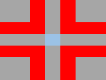

【问题描述】

给定一个只包含 '.', '#' 和 '@' 的n * m矩阵。

规定'.', '@'为灰色瓷砖，'#'为红色瓷砖。人一开始在'@'的位置，他可以上下左右四个方向移动，但是只能移动到灰色瓷砖上，不能移动到红色瓷砖上。

求人可以到达几块灰色瓷砖。

【输入形式】

共n+1行。第一行有两个整数m, n。代表矩阵的大小。

第2~n+1行，每一行有m个字符，代表每行的地图。
【输出形式】

共一行，代表人可到达灰色瓷砖的数量。
【样例输入】

7 7

..#.#..

..#.#..

\###.###

...@...

\###.###

..#.#..

..#.#..

【样例输出】

13
【样例说明】

地图如图所示，人一开始在中间，他可以走到上下左右四个方向，一共13块灰色砖块。

【评分标准】

对于100%的数据，m * n <= 100